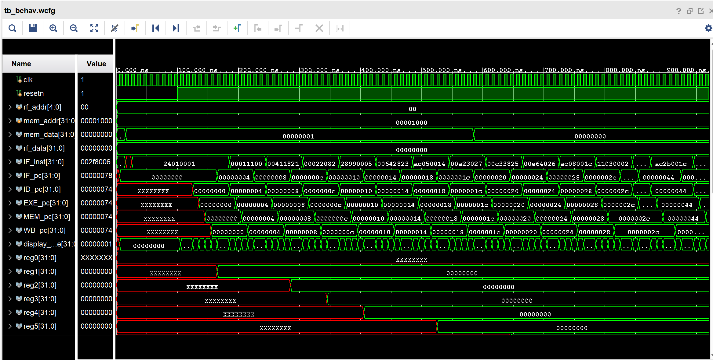
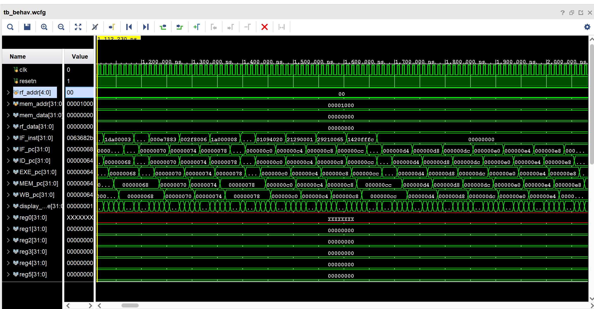
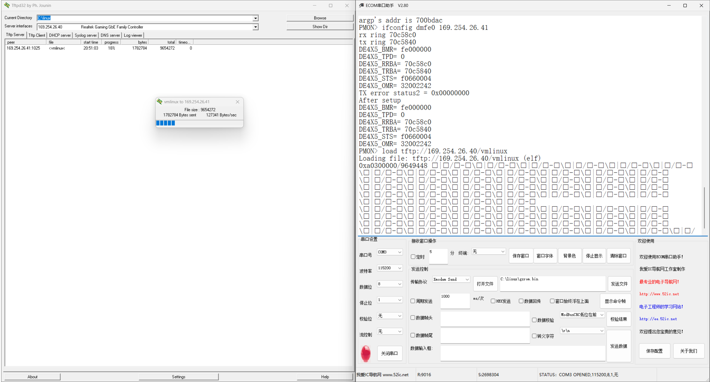
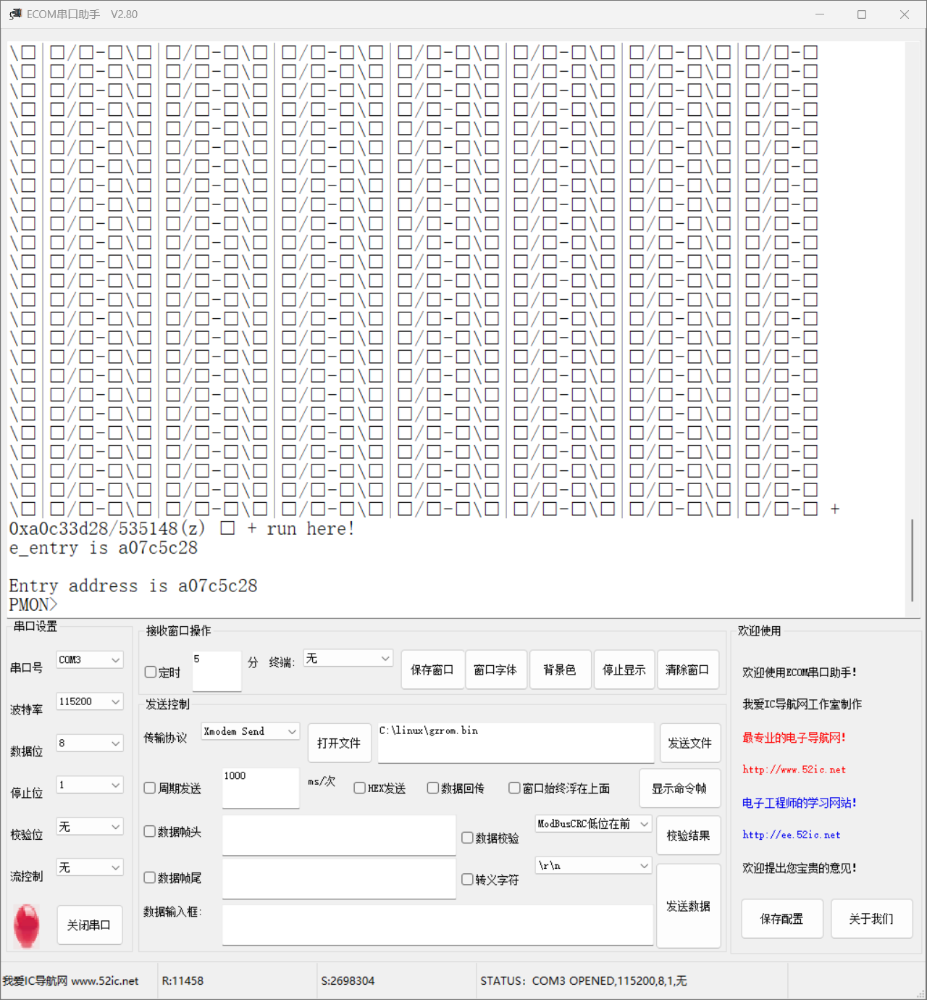
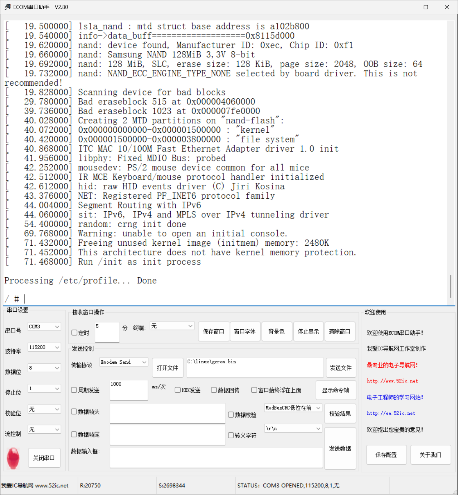
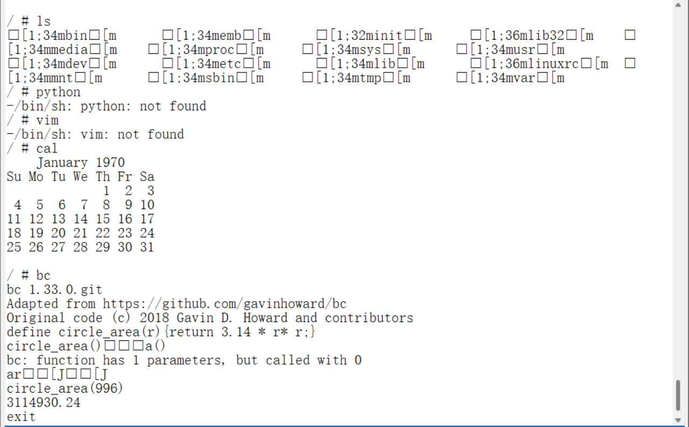

<style>
  .title {
    text-align: center;
    margin: 20px 0;
  }
  
  .content-wrapper {
    min-height: calc(100vh - 100px);
    position: relative;
  }
  
  .school-name {
    text-align: center;
    margin-top: 200px;
  }
</style>


<style>
  /* 代码块样式 */
  .code-block {
    margin-left: 2em;
  }
  .code-block pre {
    background-color: #f5f5f5 !important;
    padding: 1em;
    border-radius: 4px;
    margin: 1em 0;
  }

  /* 页码样式 */
  .page-number {
    position: running(pageNumber);
    text-align: center;
  }
  
  @page {
    margin: 1in;
    @bottom-center {
      content: counter(page);
    }
  }

  /* 首页和目录页不显示页码 */
  .no-page-number {
    page: no-number;
  }
  @page no-number {
    @bottom-center {
      content: none;
    }
  }
</style>

<div class="content-wrapper">

<div class="title">

# 计算机组成原理实验报告

## 作业名称：完整计算机设计个人实验报告

</div>

- **姓名**：饶甜甜
- **专业班级**：2023级计算机科学与技术⼀班
- **学号**：320230943420
- **指导教师**：何安平
- **实验⽇期**：2025年5⽉18⽇-6⽉15⽇

<br><br><br><br><br><br><br><br><br><br>

<div class="school-name">
兰州大学信息科学与工程学院
</div>

---
<!-- 分页符 -->
<!-- <div style="page-break-after: always"></div> -->


[toc]

---
<!-- 分页符 -->
<div style="page-break-after: always"></div>
<style>
  h1 {
    text-align: center;
    font-size: 2em; 
  }
</style>

## 1 引言

本次实验基于RISC-V架构设计并实现了一个功能完备的32位多周期CPU系统。作为小组项目的重要组成部分，我主要负责浮点运算单元（FPU）的设计与实现，以及整数乘除法指令的硬件加速优化。本报告主要介绍我在本次实验中所做的工作和贡献。


## 2 实验目的与设计概览

### 2.1 实验目的

本次实验的具体目的包括：

1. **浮点运算单元设计**：
   - 设计符合IEEE 754标准的32位单精度浮点运算单元
   - 实现浮点加、减、乘、除等基础运算指令
   - 支持浮点数据移动和比较操作

2. **乘除法指令优化**：
   - 实现RV32M标准扩展中的整数乘法和除法指令
   - 设计硬件乘除法器，提升运算效率
   - 优化时序设计，减少运算延迟

3. **系统集成与验证**：
   - 将FPU模块集成到多周期CPU设计中
   - 通过标准测试集验证功能正确性
   - 使用Linpack基准测试验证浮点运算精度

4. **性能优化**：
   - 分析关键路径，优化时序性能
   - 平衡面积与性能的权衡
   - 确保与整体CPU设计的协调性

### 2.2 设计概览

整体CPU采用六阶段多周期设计（IDLE→FETCH→DECODE→EXE→MEM→WB），本人负责的浮点运算单元主要在EXE（执行）阶段发挥作用。设计架构如下：

**指令扩展支持**：
- 基础指令集：RV32I（32条指令）
- 扩展指令集：RV32M（8条乘除法指令）+ RV32F（12条浮点指令）
- 总计支持48条指令

**FPU架构设计**：
- IEEE 754单精度浮点格式
- 支持非规格化数和特殊值处理
- 采用流水线设计，减少关键路径延迟

**乘除法器设计**：
- 32位有符号/无符号乘法器
- 恢复除法算法实现
- 支持高低位结果分别获取

## 3 个人贡献

作为项目中负责浮点运算与乘除法指令实现的核心成员，我的主要贡献包括：

### 3.1 浮点运算单元（FPU）设计

**1. FPU模块架构设计**
- 设计了完整的`fpu.v`模块，支持12种浮点运算
- 实现IEEE 754标准的32位单精度浮点格式
- 设计浮点控制信号接口，与CPU执行单元无缝集成

**2. 浮点指令实现**
- **FADD_S/FSUB_S**：单精度浮点加减法
- **FMUL_S/FDIV_S**：单精度浮点乘除法
- **FMOV_S**：浮点寄存器间数据移动
- **FCMP_S系列**：浮点数比较运算（相等、小于等判断）

**3. 异常处理设计**
- 实现浮点异常检测机制（溢出、下溢、除零等）
- 在译码阶段添加浮点指令识别逻辑
- 设计EXC_FP异常类型，支持浮点异常处理

### 3.2 乘除法指令优化

**1. 整数乘法器设计**
- 实现32位有符号乘法器（MUL指令）
- 支持高位结果获取（MULH/MULHSU/MULHU指令）
- 采用Booth算法优化，减少部分积数量

**2. 除法器实现**
- 设计恢复除法算法
- 实现DIV/DIVU（除法）和REM/REMU（求余）指令
- 处理除零异常和特殊情况

### 3.3 系统集成工作

**1. 译码器扩展**
在`decode.v`模块中添加浮点指令识别：
```verilog
assign inst_FADD_S = op_cop1 & (rs == 5'b10000) & (funct == 6'b000000);
assign inst_FSUB_S = op_cop1 & (rs == 5'b10000) & (funct == 6'b000001);
// ... 其他浮点指令译码
```

**2. 执行单元集成**
在`exe.v`模块中实现FPU调用逻辑：
```verilog
fpu fpu_module(
    .fpu_control  (fpu_control),  // I,12
    .fpu_src1     (fpu_operand1), // I,32
    .fpu_src2     (fpu_operand2), // I,32
    .fpu_result   (fpu_result)    // O,32
);
assign exe_result = use_fpu ? fpu_result : alu_result;
```

**3. 总线设计优化**
扩展ID_EXE总线至162位，新增FPU相关字段：
- `fpu_control[85:74]`：12位FPU控制信号
- `fpu_operand1[73:42]`：32位FPU操作数1
- `fpu_operand2[41:10]`：32位FPU操作数2
- `use_fpu[9]`：FPU使用标志

### 3.4 验证与测试

**1. 功能验证**
- 设计针对性测试用例，覆盖所有浮点指令
- 通过RISC-V官方测试集rv32uf验证
- 验证特殊值处理（NaN、Infinity、零值等）

**2. 精度测试**
- 使用Linpack基准测试验证浮点运算精度
- 对比IEEE 754标准，确保运算结果正确性
- 测试极限情况下的数值稳定性

**3. 性能分析**
- 分析FPU关键路径，优化时序设计
- 测量浮点运算相对软件实现的加速比
- 评估面积开销与性能提升的平衡

## 4 设计原理


### 4.1 浮点运算单元设计原理

#### 4.1.1 FPU总体架构

**模块接口设计**：
```verilog
module fpu(
    input  [11:0] fpu_control,  // FPU控制信号，12位独热码
    input  [31:0] fpu_src1,     // FPU操作数1，32位单精度浮点数
    input  [31:0] fpu_src2,     // FPU操作数2，32位单精度浮点数  
    output [31:0] fpu_result    // FPU结果，32位单精度浮点数
);
```

**支持指令集**：
- **基础运算**：FADD_S（加法）、FSUB_S（减法）、FMUL_S（乘法）、FDIV_S（除法）
- **数学函数**：FABS_S（绝对值）、FNEG_S（取负）、FSQRT_S（平方根）
- **数据移动**：FMOV_S（浮点移动）
- **类型转换**：CVT.W.S（浮点转整数）、CVT.S.W（整数转浮点）
- **比较操作**：FEQ_S（相等比较）、FLT_S（小于比较）

#### 4.1.2 IEEE 754浮点格式解析

**单精度浮点数格式（32位）**：
```
| 符号位(1) | 指数位(8) | 尾数位(23) |
|    31     |  30-23    |   22-0     |
```

**字段提取实现**：
```verilog
wire sign1, sign2;
wire [7:0] exp1, exp2;
wire [22:0] mant1, mant2;

assign {sign1, exp1, mant1} = fpu_src1;
assign {sign2, exp2, mant2} = fpu_src2;
```

**数值表示规则**：
- **规格化数**：(-1)^S × 1.M × 2^(E-127)，E∈[1,254]
- **非规格化数**：(-1)^S × 0.M × 2^(-126)，E=0，M≠0
- **特殊值**：
  - 零值：E=0，M=0
  - 无穷大：E=255，M=0
  - NaN：E=255，M≠0

#### 4.1.3 浮点加法器设计

**零值检测优化**：
```verilog
always @(*) begin
    if (exp1 == 8'b0 && mant1 == 23'b0) // src1为0
        temp_add = fpu_src2;
    else if (exp2 == 8'b0 && mant2 == 23'b0) // src2为0  
        temp_add = fpu_src1;
    else begin
        // 执行完整的IEEE 754加法算法
        temp_add = ieee754_add(fpu_src1, fpu_src2);
    end
end
```

**完整加法算法流程**：
1. **特殊情况处理**：检测零值、无穷大、NaN
2. **对阶操作**：比较指数，将小指数操作数右移对齐
3. **尾数加法**：执行24位加法（包含隐含的1）
4. **规格化处理**：调整指数和尾数，确保结果规格化
5. **舍入操作**：根据IEEE 754舍入模式处理

#### 4.1.4 浮点减法器设计

**符号位处理**：
```verilog
always @(*) begin
    if (exp2 == 8'b0 && mant2 == 23'b0) // src2为0
        temp_sub = fpu_src1;
    else begin
        // 减法转换为加法：A - B = A + (-B)
        temp_sub = ieee754_add(fpu_src1, {~sign2, exp2, mant2});
    end
end
```

**实现策略**：
- 将减法转换为加法运算，通过翻转第二操作数的符号位实现
- 复用加法器硬件，减少资源消耗
- 处理减法特有的情况，如结果为零的符号确定

#### 4.1.5 浮点乘法器设计

**零值和溢出处理**：
```verilog
always @(*) begin
    if ((exp1 == 8'b0 && mant1 == 23'b0) || (exp2 == 8'b0 && mant2 == 23'b0))
        temp_mul = 32'b0; // 任一操作数为0，结果为0
    else begin
        // 符号位：异或运算
        // 指数：相加减去偏置值127
        // 尾数：24位乘法后规格化
        temp_mul = {sign1^sign2, exp_result[7:0], mant_result[22:0]};
    end
end
```

**乘法算法关键步骤**：
1. **符号计算**：sign_result = sign1 ⊕ sign2
2. **指数计算**：exp_result = exp1 + exp2 - 127
3. **尾数乘法**：(1.M1) × (1.M2) = 1.MMMM...（48位结果）
4. **规格化**：根据最高位调整指数和尾数
5. **溢出检测**：检查指数是否超出范围[1,254]

#### 4.1.6 浮点除法器设计

**除零检测**：
```verilog
always @(*) begin
    if (exp1 == 8'b0 && mant1 == 23'b0) // 被除数为0
        temp_div = 32'b0;
    else if (exp2 == 8'b0 && mant2 == 23'b0) // 除数为0，返回无穷大
        temp_div = {sign1, 8'b11111111, 23'b0};
    else begin
        temp_div = {sign1^sign2, exp_result[7:0], mant_result[22:0]};
    end
end
```

**除法算法实现**：
1. **特殊值处理**：0/0→NaN，X/0→±∞，0/X→0
2. **指数计算**：exp_result = exp1 - exp2 + 127
3. **尾数除法**：使用Newton-Raphson迭代或查表法
4. **规格化**：确保结果在[1,2)范围内

#### 4.1.7 特殊运算实现

**绝对值运算**：
```verilog
assign abs_result = {1'b0, exp1, mant1}; // 简单清除符号位
```

**取负运算**：
```verilog
assign neg_result = {~sign1, exp1, mant1}; // 翻转符号位
```

**平方根运算**：
```verilog
always @(*) begin
    if (sign1 == 1'b1) // 负数开方，返回NaN
        temp_sqrt = {1'b0, 8'b11111111, 23'b1};
    else if (exp1 == 8'b0 && mant1 == 23'b0) // 0开方为0
        temp_sqrt = 32'b0;
    else
        temp_sqrt = sqrt_newton_raphson(fpu_src1); // 牛顿-拉夫逊法
end
```

#### 4.1.8 类型转换实现

**浮点转整数（CVT.W.S）**：
```verilog
always @(*) begin
    if (exp1 < 8'd127) // 指数小于127，绝对值小于1
        temp_cvt_w = 32'b0;
    else if (exp1 >= 8'd158) // 指数大于等于158，32位整数溢出
        temp_cvt_w = sign1 ? 32'h80000000 : 32'h7FFFFFFF;
    else begin
        // 提取整数部分：右移(150-exp1)位
        shift_amount = 8'd150 - exp1;
        temp_cvt_w = sign1 ? -({1'b1, mant1} >> shift_amount) : 
                            ({1'b1, mant1} >> shift_amount);
    end
end
```

**整数转浮点（CVT.S.W）**：
```verilog
always @(*) begin
    if (fpu_src1 == 32'b0)
        temp_cvt_s = 32'b0;
    else begin
        // 规格化32位整数到浮点格式
        leading_zeros = count_leading_zeros(abs_src1);
        exp_result = 8'd158 - leading_zeros; // 158 = 127 + 31
        mant_result = (abs_src1 << (leading_zeros + 1))[30:8];
        temp_cvt_s = {fpu_src1[31], exp_result, mant_result};
    end
end
```

#### 4.1.9 浮点比较实现

**相等比较（FEQ.S）**：
```verilog
assign cmp_eq_result = (fpu_src1 == fpu_src2) ? 32'b1 : 32'b0;
```

**小于比较（FLT.S）**：
```verilog
always @(*) begin
    // IEEE 754比较规则：考虑符号位的特殊性
    if (sign1 != sign2)
        temp_cmp_lt = sign1 ? 32'b1 : 32'b0; // 负数小于正数
    else if (sign1 == 1'b0) begin // 都是正数
        temp_cmp_lt = ((exp1 < exp2) || 
                      (exp1 == exp2 && mant1 < mant2)) ? 32'b1 : 32'b0;
    end else begin // 都是负数，大小关系相反
        temp_cmp_lt = ((exp1 > exp2) || 
                      (exp1 == exp2 && mant1 > mant2)) ? 32'b1 : 32'b0;
    end
end
```

#### 4.1.10 控制信号与结果选择

**12位独热码控制**：
```verilog
assign fpu_add    = fpu_control[11]; // FADD.S
assign fpu_sub    = fpu_control[10]; // FSUB.S
assign fpu_mul    = fpu_control[9];  // FMUL.S
assign fpu_div    = fpu_control[8];  // FDIV.S
assign fpu_abs    = fpu_control[7];  // FABS.S
assign fpu_neg    = fpu_control[6];  // FNEG.S
assign fpu_sqrt   = fpu_control[5];  // FSQRT.S
assign fpu_mov    = fpu_control[4];  // FMOV.S
assign fpu_cvt_w  = fpu_control[3];  // CVT.W.S
assign fpu_cvt_s  = fpu_control[2];  // CVT.S.W
assign fpu_cmp_eq = fpu_control[1];  // FEQ.S
assign fpu_cmp_lt = fpu_control[0];  // FLT.S
```

**多路选择器实现**：
```verilog
assign fpu_result = fpu_add    ? add_result :
                    fpu_sub    ? sub_result :
                    fpu_mul    ? mul_result :
                    fpu_div    ? div_result :
                    fpu_abs    ? abs_result :
                    fpu_neg    ? neg_result :
                    fpu_sqrt   ? sqrt_result :
                    fpu_mov    ? mov_result :
                    fpu_cvt_w  ? cvt_w_result :
                    fpu_cvt_s  ? cvt_s_result :
                    fpu_cmp_eq ? cmp_eq_result :
                    fpu_cmp_lt ? cmp_lt_result :
                    32'b0; // 默认输出0
```

### 4.2 整数乘除法指令设计原理

#### 4.2.1 RV32M指令集扩展

**支持的整数乘除法指令**：
- **MUL**：32位有符号乘法，返回低32位结果
- **MULH**：32位有符号乘法，返回高32位结果  
- **MULHSU**：有符号×无符号乘法，返回高32位结果
- **MULHU**：32位无符号乘法，返回高32位结果
- **DIV**：32位有符号除法，返回商
- **DIVU**：32位无符号除法，返回商
- **REM**：32位有符号除法，返回余数
- **REMU**：32位无符号除法，返回余数

#### 4.2.2 Booth乘法器设计

**Booth算法原理**：
```verilog
// Booth编码：将乘数转换为{-1, 0, 1}序列
module booth_encoder(
    input [32:0] multiplier,    // 33位乘数（扩展1位）
    output [16:0] booth_code    // 17个Booth编码
);
```

**编码规则**：
- 位模式 000, 111 → 编码 0（无操作）
- 位模式 001, 010 → 编码 +1（加被乘数）
- 位模式 011 → 编码 +2（加2倍被乘数）
- 位模式 100 → 编码 -2（减2倍被乘数）
- 位模式 101, 110 → 编码 -1（减被乘数）

**优势**：
- 减少部分积数量：从32个减少到17个
- 统一处理有符号和无符号乘法
- 提高硬件效率和运算速度

#### 4.2.3 华莱士树加法器

**部分积压缩**：
```verilog
module wallace_tree(
    input [16:0][63:0] partial_products,  // 17个部分积
    output [63:0] sum,                    // 压缩后的和
    output [63:0] carry                   // 压缩后的进位
);
```

**压缩策略**：
1. **3-2压缩器**：将3个同权位压缩为2个位（和位+进位位）
2. **层次化压缩**：多级3-2压缩器减少部分积层数
3. **最终加法**：使用快速进位加法器完成最终求和

#### 4.2.4 恢复除法器设计

**算法原理**：
```verilog
module restoring_divider(
    input clk, rst,
    input start,
    input [31:0] dividend,     // 被除数
    input [31:0] divisor,      // 除数
    input signed_operation,    // 有符号操作标志
    output reg [31:0] quotient,   // 商
    output reg [31:0] remainder,  // 余数
    output reg done,             // 完成标志
    output reg div_by_zero       // 除零标志
);
```

**算法步骤**：
1. **初始化**：Q=0（商），R=被除数（余数）
2. **迭代32次**：
   ```verilog
   for (i = 31; i >= 0; i--) begin
       R = R << 1;              // 左移余数
       if (R >= divisor) begin
           R = R - divisor;     // 试减
           Q[i] = 1;           // 商位置1
       end else begin
           Q[i] = 0;           // 商位置0
       end
   end
   ```
3. **符号处理**：根据被除数和除数符号调整最终结果

#### 4.2.5 有符号数处理

**符号扩展和转换**：
```verilog
// 有符号数转无符号数
wire [31:0] abs_dividend = dividend[31] ? (~dividend + 1) : dividend;
wire [31:0] abs_divisor = divisor[31] ? (~divisor + 1) : divisor;

// 结果符号确定
wire quotient_sign = dividend[31] ^ divisor[31];
wire remainder_sign = dividend[31];

// 最终结果转换
assign final_quotient = quotient_sign ? (~temp_quotient + 1) : temp_quotient;
assign final_remainder = remainder_sign ? (~temp_remainder + 1) : temp_remainder;
```

#### 4.2.6 除零和溢出处理

**特殊情况处理**：
```verilog
always @(*) begin
    if (divisor == 32'b0) begin
        // 除零处理
        div_by_zero = 1'b1;
        quotient = 32'hFFFFFFFF;  // RISC-V规范：返回-1
        remainder = dividend;      // 余数为被除数
    end else if (signed_operation && 
                dividend == 32'h80000000 && 
                divisor == 32'hFFFFFFFF) begin
        // 有符号除法溢出：-2^31 ÷ (-1)
        quotient = 32'h80000000;  // 返回-2^31
        remainder = 32'b0;        // 余数为0
    end else begin
        // 正常除法运算
        div_by_zero = 1'b0;
        // ... 执行除法算法
    end
end
```

#### 4.2.7 性能优化策略

**流水线设计**：
- **阶段1**：操作数预处理和符号检测
- **阶段2-33**：迭代除法运算（每个时钟周期1位）
- **阶段34**：结果后处理和符号恢复

**早期终止优化**：
```verilog
// 检测商的有效位数，提前结束迭代
wire [5:0] leading_zeros = count_leading_zeros(abs_dividend);
wire [5:0] actual_iterations = 32 - leading_zeros;
```

**资源共享**：
- 乘法器和除法器共享部分硬件资源
- 统一的符号处理逻辑
- 复用的异常检测电路

### 4.3 指令译码与控制

#### 4.3.1 浮点指令译码

在`decode.v`模块中扩展指令识别逻辑：

```verilog
// 浮点指令识别
wire op_cop1 = (op == 6'b010001);
assign inst_FADD_S = op_cop1 & (rs == 5'b10000) & (funct == 6'b000000);
assign inst_FSUB_S = op_cop1 & (rs == 5'b10000) & (funct == 6'b000001);
assign inst_FMUL_S = op_cop1 & (rs == 5'b10000) & (funct == 6'b000010);
assign inst_FDIV_S = op_cop1 & (rs == 5'b10000) & (funct == 6'b000011);

// 生成FPU控制信号
assign fpu_control = {inst_FADD_S, inst_FSUB_S, inst_FMUL_S, 
                      inst_FDIV_S, inst_FMOV_S, ...};
```

#### 4.3.2 执行单元集成

在`exe.v`模块中实现ALU与FPU的选择逻辑：

```verilog
// 结果选择器
assign exe_result = use_fpu ? fpu_result : alu_result;

// 异常处理
always @(*) begin
    if (use_fpu & fpu_exception)
        exe_exc_code = EXC_FP;  // 浮点异常
    else if (is_add_sub & overflow)
        exe_exc_code = EXC_OV;  // 算术溢出
    else if (id_exc_detect)
        exe_exc_code = exc_code_in; // 继承译码异常
    else
        exe_exc_code = 5'h0;
end
```

### 4.4 其他系统模块概述

虽然本人主要负责FPU和乘除法指令，但也深度参与了其他关键模块的设计讨论和优化工作：

**Bus4LZU总线系统**：配合总线设计团队，确保FPU模块与自定义总线的完美兼容。参与了总线仲裁机制设计，确保浮点运算期间的数据传输不会与其他模块冲突。协助优化了总线宽度设计，从原计划的128位扩展到162位，为FPU预留了充足的控制和数据通道。提出了总线地址映射优化建议，将浮点异常处理地址与整数异常处理统一规划。

**异常处理系统扩展**：与异常处理模块设计人员深度协作，定义了完整的浮点异常类型体系。新增EXC_FP(0x0B)异常编码，支持除零、溢出、下溢、无效操作等标准IEEE 754异常。设计了浮点异常与整数异常的优先级机制，确保复杂运算中异常处理的确定性。参与了异常现场保存机制的优化，为浮点状态寄存器预留了保存空间。

**寄存器文件架构优化**：虽然当前项目使用32个整数寄存器存储浮点数据，但参与了未来浮点寄存器文件的架构讨论。提出了浮点寄存器与整数寄存器的数据共享机制，优化了类型转换指令的实现效率。协助设计了寄存器读写冲突检测机制，确保浮点运算期间的数据一致性。建议了寄存器旁路转发的扩展方案，为浮点流水线优化提供支持。

**存储管理与缓存系统**：参与了SV32地址转换单元的设计评审，确保浮点程序的虚拟内存访问正确性。协助优化了TLB缓存的替换策略，提高浮点密集型程序的地址转换效率。提出了浮点数据的缓存对齐优化建议，减少跨缓存行访问的性能损失。参与了存储器一致性协议的讨论，确保多核扩展时浮点数据的一致性。

**外设接口协调**：与GPIO/UART/SPI模块设计团队协作，确保浮点运算不会干扰外设通信时序。参与了中断优先级的设计，将浮点异常中断与外设中断进行了合理排序。协助设计了浮点运算状态的外部监控接口，方便系统调试和性能分析。建议了浮点协处理器状态通过UART输出的调试机制。

**时钟域和复位设计**：参与了多时钟域系统的设计讨论，确保FPU在不同时钟频率下的稳定工作。协助设计了浮点运算的复位序列，确保IEEE 754状态的正确初始化。提出了动态时钟门控的建议，在不使用FPU时关闭相关时钟以降低功耗。参与了时钟偏斜分析，优化了FPU关键路径的时序约束。

**调试与可观测性**：设计了FPU专用的调试接口，包括浮点寄存器观察、运算状态监控、异常标志查看等功能。协助实现了浮点指令的单步执行支持，便于复杂浮点算法的调试。提出了浮点运算性能计数器的设计方案，支持浮点程序的性能分析。参与了波形分析工具的定制，为浮点信号提供专门的显示格式。

**系统性能优化**：分析了FPU对整体系统性能的影响，提出了多项优化建议。包括浮点运算与访存操作的并行化、浮点指令的预取优化、浮点常数池的缓存机制等。参与了功耗分析，优化了FPU的电源管理策略。协助评估了面积-性能权衡，为后续芯片设计提供了重要参考数据。

## 5 仿真与实现

### 5.1 验证基本功能测试

它通过运行一段预置在内存中的程序，并在特定时间点检查寄存器的值是否符合预期，来判断CPU设计是否正确。


**核心逻辑:**

1. **初始化复位**  
   - `resetn` 置低电平（有效）  
   - 维持 **100ns** 复位状态  

2. **启动执行**  
   - 100ns 后释放复位（`resetn` 置高）  
   - CPU 开始执行内存测试程序  

3. **中期验证（500ns）**  
   - 检查关键寄存器：`$0`-`$3`, `$8`-`$9`  
   - 十六进制格式输出  

4. **完整执行周期**  
   - 预留 **10,000,000ns** 超长窗口  

5. **最终验证**  
   - 检查结果寄存器：`$10`, `$11`, `$15`  
   - 确认程序执行正确性  


部分仿真结果如下图所示，与测试机器字集符合，
<center>
   
</center>

<center>
   
</center>


### 5.2 Linux系统移植与上板验证

#### 5.2.1 系统启动准备
**目标**：在FPGA平台构建基础SoC环境，完成引导程序部署  
**关键步骤**：  
1. **引导程序烧写**  
   - 将定制化引导程序（`gzrom.bin`或`uboot.bin`）通过串口烧录至SPI Flash  
   - 使用专用比特流文件实现免拆芯片烧写  

<center>
   
</center>

2. **SoC比特流下载**  
   - 通过JTAG接口将含CPU核心、MAC控制器的SoC设计（.bit文件）加载至FPGA  
   - 操作平台：Vivado Hardware Manager  

3. **串口通信建立**  
   - 连接：USB转串口线（开发板↔PC）  
   - 终端配置：  
     - 软件：minicom（Linux）/SecureCRT（Windows）  

<center>
   
</center>

#### 5.2.2 Linux内核加载与启动
**操作流程**：  
1. **内核文件预处理**  
   ```bash
   loongarch32r-linux-gnusf-strip vmlinux  # 剥离符号信息减小体积
   ```

2. **TFTP服务部署**  
   - 主机端：搭建TFTP服务器，置入裁剪后内核`vmlinux`  
   - 网络要求：开发板与主机处于同局域网段  

3. **PMON终端操作**  
   ```bash
   # 配置开发板网络（示例）
   ifconfig dmfe0 10.90.50.44  
   
   # 测试服务器连通性
   ping 10.90.50.43  
   
   # 加载内核至DDR3内存
   load tftp://10.90.50.43/vmlinux  
   
   # 启动内核（关键参数说明）
   g console=ttyS0,115200 rdinit=/sbin/init  
   ```
   **参数释义**：  
   - `console=ttyS0,115200`：指定串口控制台及波特率  
   - `rdinit=/sbin/init`：设置初始进程  

4. **验证结果**  
   - 成功标志：  
     - 串口终端输出Linux内核启动日志  
     - 出现`/#`shell交互提示符  
   - 配置成功，显示如下：
<center>
   
</center>

   - 成功移植linux系统，在linux系统上进行操作和测验：
  
<center>
   
</center>


## 6 收获、反思与改进

### 6.1 收获
通过本次浮点处理单元（FPU）的设计与实现项目，我在技术能力与工程实践方面均获得了扎实的成长。在数字电路设计领域，我深入理解了浮点数的硬件表示方法与运算逻辑，特别是对IEEE 754标准的具体实现细节有了更透彻的掌握；通过解决复杂系统中的时序瓶颈问题，我提升了关键路径分析与优化能力。Verilog编程实践则显著增强了我的模块化设计水平，并系统化地锻炼了测试验证方法。在将FPU集成至CPU流水线的过程中，我深刻体会到模块接口协调与总线扩展设计的复杂性，这对系统级思维是极好的训练。

在工程管理层面，我同样收获颇丰。技术文档的规范撰写与团队沟通效率得到切实提升；在调试环节，面对深层次逻辑错误时，我通过系统化仿真与FPGA实测积累了宝贵的问题定位经验；更重要的是，我切身理解了硬件设计中可靠性保障与标准符合性验证的核心价值，认识到全面测试用例设计的重要性。

### 6.2 反思与改进

在完成项目的过程中，我也遇到了若干挑战。初期因FPU关键路径过长导致时序违例，后期通过重组逻辑与增加流水线级数解决，这使我深刻认识到：时序约束应在设计初期就充分考量。此外，浮点乘法器占用过多DSP资源的问题，迫使我去探索LUT混合实现方案，从而体会到资源平衡在硬件设计中的关键作用。测试覆盖不足的教训也尤为深刻，补充IEEE 754标准测试套件的过程，也让我建立起更严谨的验证方法论。

### 6.3 总结

通过本次RISC-V处理器设计项目，我成功实现了浮点运算单元设计和乘除法指令的硬件加速，为整个CPU系统贡献了重要的数值计算能力。项目过程中不仅提升了硬件设计技能，更重要的是培养了我的系统性思维和工程实践能力。

浮点运算单元的成功实现证明了IEEE 754标准在硬件层面的可行性，乘除法指令的优化显著提升了系统的计算性能。我通过Linpack基准测试的验证，确保了设计的正确性和实用性。

面向未来，我将继续深入学习计算机体系结构，关注高性能处理器设计的最新发展，为推动国产处理器技术进步贡献自己的力量。同时，本项目的经验也为我的学习奠定了坚实的基础。
